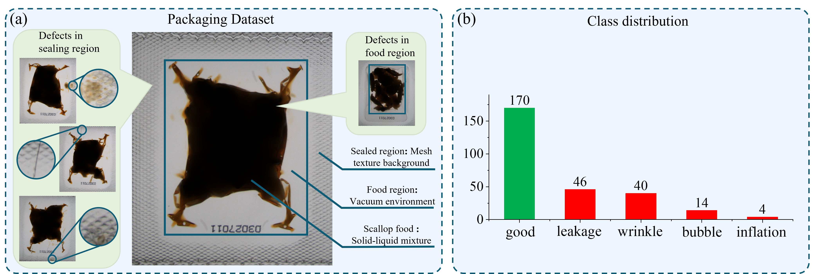

# Vaccum-packaging-dataset

This is a seafood food vacuum packaging data set applied to industrial defect detection. It includes 274 images with a resolution of 800×930. It is divided into 170 normal samples and 104 defect samples, including four types of defects: bubble, leakage, inflation and wrinkle. The statistics of the dataset are as follows:

